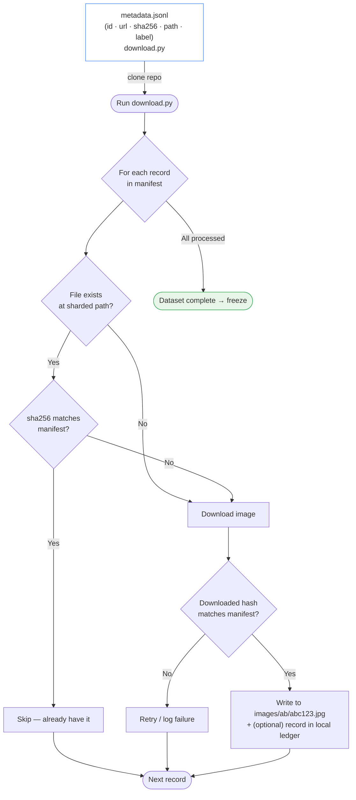

# dataset
Dataset builder workflow

## Why?
The _Faces of the past_ project requires all of us to work on the same datset.
The dataset contains a collection of images and their corresponding metadata.
Here we provide a script that:

1. Takes the metadata sheet `workflow.jsonl` as an input.
2. Downloads each image locally.
3. Checks the consistency of the downloads. If something is missing or wrong, re-downloads that and only that.

## How to use?
We are using `poetry` for dependency management. Install `poetry` and run:

```sh
poetry run python download.py
```

If you prefer to use your own dependency management system, just run `python download.py`.

## Architecture

### Visual workflow

